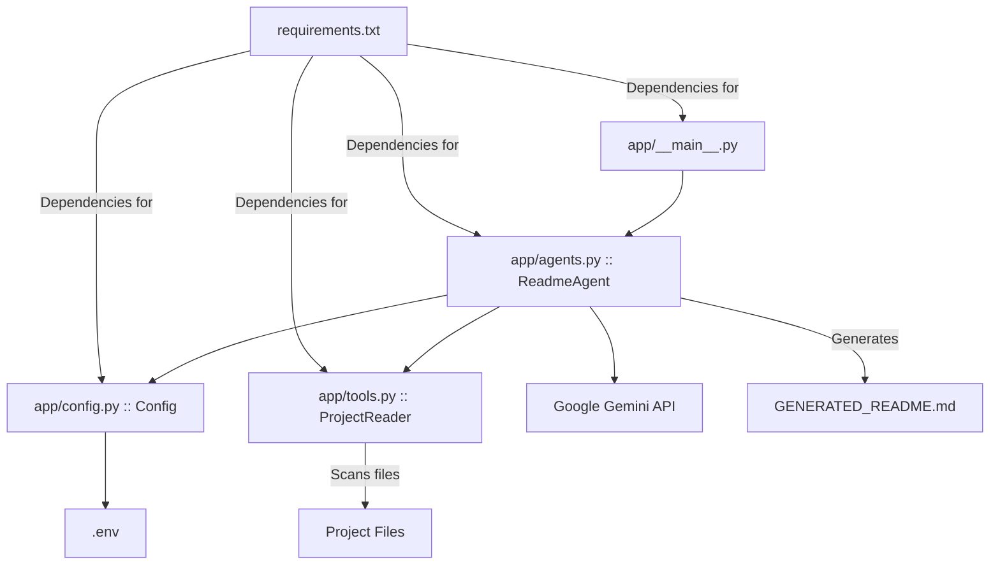

# RepoXray: AI-Powered README Generation & Code Audit

RepoXray is an innovative AI orchestrator designed to revolutionize software project documentation. Leveraging Google's Gemini models and a sophisticated Map-Reduce architecture, it automatically generates comprehensive, professional `README.md` files from any codebase. Beyond basic project summarization, RepoXray performs an integrated code health and security audit, identifying potential vulnerabilities, code smells, and documentation gaps, providing developers with both detailed project insights and a ready-to-use `README.md`.

## 📊 Architecture Diagram



## Folder Structure

```
📁 RepoXray/
    📄 .env
    📄 GENERATED_README.md
    📄 README.md
    📄 requirements.txt
    📁 app/
        📄 agents.py
        📄 config.py
        📄 tools.py
        📄 __main__.py
```

## Architecture/Tech Stack

RepoXray employs a robust architecture primarily built on Python, designed to handle extensive codebases by breaking down the documentation and auditing process into manageable, concurrent steps.

*   **Core Language:** Python
*   **AI Models:** Google Gemini (specifically `gemini-2.5-flash` for efficient processing) is used for both the "Map" phase (individual file summarization and initial audit) and the "Reduce" phase (synthesis of the final `README.md` and overall audit report).
*   **Architecture Pattern:** A custom Map-Reduce pattern addresses Large Language Model (LLM) token limitations.
    *   **Map Phase:** Individual project files are concurrently summarized and audited using the AI.
    *   **Reduce Phase:** These summaries, along with the inferred project structure, are synthesized into a comprehensive `README.md`.
*   **Dependency Management:** `pip` with `requirements.txt` ensures all necessary external libraries are installed.
*   **Environment Configuration:** `python-dotenv` is utilized for secure management of sensitive API keys and other configuration variables via `.env` files.
*   **API Resilience:** The `tenacity` library provides robust retry mechanisms with exponential backoff for AI API calls, enhancing stability against transient network issues or rate limits.
*   **File System Interaction:** A dedicated `ProjectReader` (in `app/tools.py`) intelligently scans project directories, filters out irrelevant files based on common patterns and `.gitignore` rules, and extracts content for LLM processing.
*   **Concurrency:** `ThreadPoolExecutor` is implicitly used (or implied by the design for parallel processing of files) to speed up the Map phase.

## Setup & Usage

Follow these steps to set up and run RepoXray.

### Prerequisites

*   Python 3.8+
*   A Google API Key with access to Gemini models.

### Installation

1.  **Clone the repository:**
    ```bash
    git clone https://github.com/your-username/RepoXray.git
    cd RepoXray
    ```

2.  **Create and activate a virtual environment (recommended):**
    ```bash
    python -m venv .venv
    # On Windows
    .venv\Scripts\activate
    # On macOS/Linux
    source .venv/bin/activate
    ```

3.  **Install dependencies:**
    ```bash
    pip install -r requirements.txt
    ```

### Configuration

1.  **Create a `.env` file:** In the root directory of the `RepoXray` project (next to `requirements.txt`), create a file named `.env`.

2.  **Add your Google API Key:** Open the `.env` file and add your Google API Key as follows, replacing `YOUR_GOOGLE_API_KEY` with your actual key:
    ```
    GOOGLE_API_KEY=YOUR_GOOGLE_API_KEY
    ```

### Running RepoXray

To generate a `README.md` for a project, navigate to the `RepoXray` root directory and run the application.

*   **To scan the current directory:**
    ```bash
    python -m app
    ```

*   **To scan a specific project directory:**
    ```bash
    python -m app --dir /path/to/your/project
    ```
    Replace `/path/to/your/project` with the absolute or relative path to the project you wish to document.

Upon successful completion, a file named `GENERATED_README.md` will be created in the `RepoXray` project's root directory (or the specified `--dir` if output is directed there, though currently it's hardcoded to the execution directory).

## File Overview

*   **`.env`**: This file stores environment variables crucial for the application, primarily the `GOOGLE_API_KEY`. It ensures sensitive credentials are not hardcoded.

*   **`requirements.txt`**: Lists all external Python packages required for the project, ensuring a consistent development and deployment environment.

*   **`app/__main__.py`**: The main entry point of the application. It handles command-line argument parsing (e.g., specifying the target directory) and orchestrates the execution of the `ReadmeAgent`.

*   **`app/agents.py`**: Defines the `ReadmeAgent` class, which is the core intelligence of RepoXray. It manages the Map-Reduce process, interacting with the LLM to summarize individual files, perform audits, and synthesize the final `README.md`.

*   **`app/config.py`**: Centralizes application settings. It loads environment variables from `.env` and defines configuration parameters for AI models and API keys, including validation logic for essential variables.

*   **`app/tools.py`**: Contains the `ProjectReader` utility class. This class is responsible for scanning the project directory, reading file contents, generating a folder structure representation, and applying `.gitignore`-like filtering rules to optimize LLM token usage.

## 🕵️‍♂️ Code Health & Security Audit

This section aggregates findings from the internal audits performed on the RepoXray codebase itself, providing a transparent overview of its current state regarding security, quality, and potential limitations.

### Security Flaws

1.  **Credential Exposure Risk (.env):** The primary security concern remains the `GOOGLE_API_KEY` stored in `.env`. While appropriate for local development, there's a significant risk of accidental commitment to version control. For production deployments, more robust secret management solutions (e.g., cloud-specific secret managers, environment variables managed by orchestrators) are imperative.
2.  **Path Traversal Vulnerability (Potential):** A theoretical path traversal vulnerability exists in `app/tools.py`'s `ProjectReader` if the `root_dir` input is not strictly validated against untrusted user-supplied paths. Although the current `__main__.py` parses a local directory, this aspect is critical for any future expansion involving external inputs.
3.  **False Sense of Security (Audit Feature):** The "Integrated Security & Health Audit" feature, while a valuable goal, lacks detailed methodology. Using a fast LLM like `gemini-2.5-flash` for critical audit synthesis may optimize for speed/cost but raises questions about the depth and accuracy of vulnerability detection or hardcoded secret identification. This could inadvertently lead to a false sense of security for users if actual critical flaws are missed.

### Code Smells & Quality Issues

1.  **Missing Docstrings:** A pervasive lack of comprehensive docstrings affects several key components:
    *   `ReadmeAgent` class (`app/agents.py`)
    *   `main()` function (`app/__main__.py`)
    *   `validate` method in `Config` (`app/config.py`)
    *   Private helper methods (`_load_gitignore`, `_is_ignored`) in `app/tools.py`
    This omission significantly hinders maintainability and understandability for new contributors.
2.  **Inconsistent Logging:** The extensive use of `print()` statements, especially within `app/tools.py`'s `ProjectReader`, is a code smell. It tightly couples logic with direct console output. Adopting Python's standard `logging` module would provide a more robust, configurable, and scalable approach to error and progress reporting.
3.  **Hardcoding & Magic Numbers:** Several instances of hardcoded values limit flexibility and readability:
    *   **Crude Rate Limiting:** `time.sleep(3)` in `_process_single_file` (`app/agents.py`) is an inefficient and blunt rate-limiting mechanism. It introduces a fixed delay per file regardless of actual API usage, drastically slowing down processing for larger projects.
    *   **Content Truncation Limit:** The `15000` character limit for LLM input in `_summarize_file` (`app/agents.py`) is hardcoded. Ideally, this should be configurable or, more advanced, token-aware.
    *   **Output Filename:** `GENERATED_README.md` is hardcoded as the output filename in `app/agents.py`.
    *   **Ignored Patterns:** `ignore_dirs` and `ignore_extensions` in `app/tools.py` are hardcoded lists.
    *   **Indentation:** A fixed numerical indentation (`4`) in `generate_folder_tree` (`app/tools.py`) is a minor "magic number."
    *   **Concurrency Limit:** The `max_workers` (capped at 3) for the `ThreadPoolExecutor` (as identified in the `GENERATED_README.md` audit) is a hardcoded performance bottleneck.
4.  **Embedded Prompts:** Long prompt templates are embedded directly within `app/agents.py`. Externalizing these into separate files or configuration would improve manageability and facilitate easier updates or experimentation.
5.  **Design Inconsistency (README Template):** The project's internal `README.md` template is noted to use HTML despite its Markdown extension, leading to inconsistent rendering expectations.

### Bugs & Functional Limitations

1.  **Simplified `.gitignore` Parsing:** The `_is_ignored` method in `app/tools.py` uses `fnmatch`, which is a simplification of the full Git `.gitignore` specification. It does not correctly handle negative patterns (`!pattern`), comments (`#`), or fully differentiate between file-only and directory-only patterns. This can lead to minor discrepancies compared to actual Git behavior.
2.  **Inefficient Performance (Rate Limiting & Concurrency):** The `time.sleep(3)` rate limiter and a low `max_workers` cap (3) in `app/agents.py` significantly impede performance, especially for projects with numerous files. A more dynamic or token-bucket-based approach would be far more efficient.
3.  **Incomplete Content Analysis:** The hardcoded content truncation means very large files might not be fully analyzed by the LLM, potentially leading to incomplete or inaccurate summaries and audits for those specific files.
4.  **Incomplete Configuration Validation:** While `GOOGLE_API_KEY` is validated in `app/config.py`, the `MAP_MODEL` and `REDUCE_MODEL` variables are not explicitly checked for their presence or validity. This relies solely on sensible defaults, which might not be sufficient for all operational scenarios.