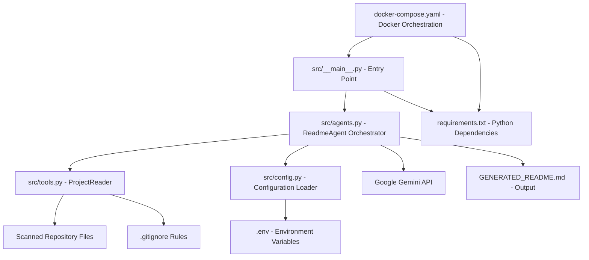

# RepoXray: AI-Powered README Generation and Code Audit

RepoXray is an advanced AI orchestrator designed to automatically generate comprehensive `README.md` files and perform integrated code health and security audits for any given software repository. Leveraging Google's Gemini models and a sophisticated Map-Reduce architecture, RepoXray overcomes traditional Large Language Model (LLM) token limits by intelligently processing and summarizing individual project files. It then synthesizes this information, along with the project's structure, into a high-quality, structured `README`, complete with architecture diagrams, setup instructions, and an aggregated code health report. Built for developers, RepoXray aims to streamline documentation, provide immediate code insights, and offer robust project overviews.

## 📊 Architecture Diagram



## Folder Structure

```
📁 RepoXray/
    📄 .env
    📄 .gitignore
    📄 docker.compose.yaml
    📄 GENERATED_README.md
    📄 README.md
    📄 requirements.txt
    📁 DockerFile/
    📁 src/
        📄 agents.py
        📄 config.py
        📄 tools.py
        📄 __init__.py
        📄 __main__.py
```

## Architecture/Tech Stack

RepoXray employs a robust architecture primarily built on Python, utilizing a Map-Reduce pattern to efficiently process codebases with LLMs.

*   **Core Language**: Python
*   **AI/ML**: Google Gemini (GenAI models) for advanced natural language understanding and generation, forming the backbone of the documentation and audit capabilities.
*   **Orchestration Pattern**: Custom Map-Reduce architecture designed to segment and process large codebases, overcoming inherent LLM token limits by summarizing individual files before a final synthesis step.
*   **Dependency Management**: `pip` for managing project dependencies, specified in `requirements.txt`.
*   **Environment Configuration**: `python-dotenv` for securely loading environment-specific variables, particularly API keys.
*   **File System Utilities**: `pathspec` and `fnmatch` for intelligent parsing of `.gitignore` rules and efficient traversal of project directories.
*   **API Resiliency**: `tenacity` for implementing robust retry mechanisms with exponential backoff, ensuring resilience against intermittent API failures.
*   **Terminal Styling**: `colorama` for enhancing terminal output with colored text, improving readability of logs and reports.
*   **Containerization**: Docker and Docker Compose for creating portable, isolated, and easily deployable development and production environments.

## Setup & Usage

Follow these steps to set up and run RepoXray.

### 1. Clone the Repository

First, clone the RepoXray repository to your local machine:

```bash
git clone [YOUR_REPO_URL_HERE]
cd RepoXray
```
*(Note: Replace `[YOUR_REPO_URL_HERE]` with the actual repository URL.)*

### 2. Configure Environment Variables

Create a `.env` file in the root directory of the project and populate it with your Google API Key:

```
GOOGLE_API_KEY="YOUR_GOOGLE_API_KEY_HERE"
```
**CRITICAL**: Ensure this `.env` file is never committed to version control. It is already included in the provided `.gitignore` file, but double-check your local setup.

### 3. Setup with Docker Compose (Recommended)

Docker Compose provides an isolated and consistent environment to run RepoXray.

```bash
# Build the Docker image
docker-compose build

# To run RepoXray and generate a README for the current directory:
docker-compose run --rm repoxray python src/__main__.py .

# To generate a README for a specific project path (e.g., a sibling directory named 'my_project'):
# Ensure the project path is accessible within the container (you might need to mount it in docker-compose.yaml)
# docker-compose run --rm repoxray python src/__main__.py /path/to/my_project_within_container
```

### 4. Local Python Setup

If you prefer to run RepoXray directly on your host machine:

```bash
# Ensure Python 3.x is installed on your system.
# Create a virtual environment
python -m venv venv
source venv/bin/activate # On Windows, use: .\venv\Scripts\activate

# Install required Python packages
pip install -r requirements.txt

# Run RepoXray for the current directory
python src/__main__.py .

# Run RepoXray for a specific project path
python src/__main__.py /path/to/your/project
```

Upon successful execution, a `GENERATED_README.md` will be created in the current working directory, containing the comprehensive documentation and audit findings for the scanned project.

## File Overview

*   **`.env`**: A configuration file used to store environment-specific variables, most notably the `GOOGLE_API_KEY`, which is crucial for authenticating and authorizing requests to Google services.
*   **`.gitignore`**: Specifies files and directories that Git should ignore. It primarily ensures that sensitive files like `.env` and compiled Python artifacts are not committed to version control.
*   **`docker.compose.yaml`**: Defines and runs multi-container Docker applications. It orchestrates the RepoXray service, specifying its build context, dependencies, and command execution.
*   **`GENERATED_README.md`**: This file is the output of the RepoXray project. It contains the comprehensive, AI-generated documentation, including architecture, setup, usage, and a self-audit of the scanned repository.
*   **`README.md`**: The project's primary introductory documentation, providing an overview of RepoXray's purpose, key features, and initial setup instructions.
*   **`requirements.txt`**: Lists all external Python packages and their version constraints required for the project to run, ensuring a consistent environment.
*   **`src/agents.py`**: Defines the `ReadmeAgent` class, which orchestrates the entire README generation process. It implements a Map-Reduce strategy, leveraging Google's GenAI models to summarize individual files and then synthesize a complete `README.md`, including an integrated security and health audit.
*   **`src/config.py`**: Manages application configuration. It loads environment variables from `.env` using `python-dotenv` and centralizes access to settings like `GOOGLE_API_KEY` and specific AI model names, including a validation mechanism for critical variables.
*   **`src/tools.py`**: Contains the `ProjectReader` class, a utility responsible for analyzing a given project directory. It generates the folder structure and reads relevant source file contents, filtering out irrelevant files and respecting `.gitignore` rules to optimize LLM input.
*   **`src/__main__.py`**: The main entry point for the RepoXray application. It initializes the `ReadmeAgent`, processes command-line arguments for the target directory, and manages the overall workflow for README generation, including basic error handling.

## 🕵️‍♂️ Code Health & Security Audit

This section aggregates the findings from an internal audit of the RepoXray codebase itself, providing a professional overview of its health, potential security considerations, and areas for improvement.

### Security Considerations

1.  **Sensitive Credential Handling (`.env`, `.gitignore`):**
    *   The project correctly uses a `.env` file for `GOOGLE_API_KEY`, which is a recommended practice to avoid hardcoding secrets. However, it is **CRITICAL** that this `.env` file is *never* committed to version control and is secured appropriately in production environments.
    *   A critical issue was identified in the `.gitignore` file, which contained an incomplete API key placeholder (`GOOGLE_API_KEY = `). This is a severe misplaced content error, indicating a misunderstanding of `.gitignore`'s purpose and a potential for insecure credential management if an actual key had been placed there. The `.gitignore` should only specify patterns to ignore, particularly `/.env`.
2.  **LLM Prompt Injection (Informational):**
    *   The `ReadmeAgent` (`src/agents.py`) feeds arbitrary file content from scanned repositories into LLM prompts. While the output is documentation, there's an inherent, albeit low, risk of prompt injection if processing highly malicious or untrusted repositories. The agent's instructions aim to mitigate this by directing output to a specific structure.
3.  **Input Validation and Path Traversal (`src/__main__.py`, `src/agents.py`):**
    *   The `src/__main__.py` entry point handles target directory input. The `ReadmeAgent` (`src/agents.py`) then processes files within this directory. It is crucial to ensure that the file processing logic within the agent and the `ProjectReader` (`src/tools.py`) is robust against vulnerabilities like path traversal or arbitrary code execution, especially if processing untrusted project inputs. Currently, the `ProjectReader` only reads file content, which limits immediate execution risks, but robust input sanitization remains a best practice.

### Code Health and Quality

1.  **Missing Docstrings:**
    *   The `validate` class method in `src/config.py` lacks a docstring, making its purpose less immediately clear.
    *   The `main()` function in `src/__main__.py`, as a public entry point, is missing a docstring, which is a significant code smell for maintainability and clarity.
2.  **Performance & Magic Numbers (`src/agents.py`):**
    *   A hardcoded `time.sleep(3)` within `_process_single_file` in `src/agents.py` acts as a static rate-limiting mechanism. While effective for free-tier limits, it significantly degrades performance for larger projects. A more dynamic or adaptive rate-limiting strategy would improve efficiency.
    *   The truncation of file content (`content[:15000]`) in `src/agents.py` uses a magic number. For very large files, this fixed limit could lead to loss of critical information, resulting in incomplete or inaccurate summaries and audits. This threshold should ideally be configurable.
3.  **Configuration Management (`src/config.py`):**
    *   Comments like "Using the newer Gemini 2.x models for better performance" are specific and could introduce noise into the configuration file. While useful context, they might be better placed in higher-level design documentation.
    *   For more complex projects, adopting a library like Pydantic's `BaseSettings` could offer enhanced type validation, default handling, and a more structured approach to configuration, improving maintainability.
4.  **Error Handling (`src/__main__.py`):**
    *   While error messages for common issues are user-friendly, unexpected `Exception`s caught in `src/__main__.py` do not print a stack trace. This can hinder debugging in development environments, though it might be desired behavior in production.
5.  **Git Ignore Parsing Simplification (`src/tools.py`):**
    *   The `.gitignore` parsing logic in `src/tools.py` simplifies the full `.gitignore` specification (e.g., handling of leading/trailing slashes, negation patterns). This simplification might lead to slightly different ignoring behavior compared to a strict Git implementation, potentially over-ignoring or under-ignoring files. Using a dedicated library like `pathspec` for strict adherence is recommended for production-grade robustness.
    *   The use of `print` statements for warnings (`⚠️ Skipping empty file`) in `src/tools.py` could be replaced with a proper logging mechanism, allowing for more controlled and configurable output in different environments.

### Overall Health Summary

The RepoXray project demonstrates a strong foundation with a clear architectural vision (Map-Reduce with LLMs) and good practices in many areas (e.g., secure API key loading, comprehensive docstrings in `src/agents.py` and `src/tools.py`). The existing `README.md` is also well-structured and clear.

However, the audit reveals several areas for improvement: enhancing the robustness of input validation, refining the `.gitignore` parsing, introducing more flexible rate-limiting, and improving configuration management. Most critically, the `.gitignore` file's misplaced content highlights a need for rigorous attention to security best practices, particularly regarding sensitive credentials. Addressing these points will significantly enhance RepoXray's stability, security, and maintainability.