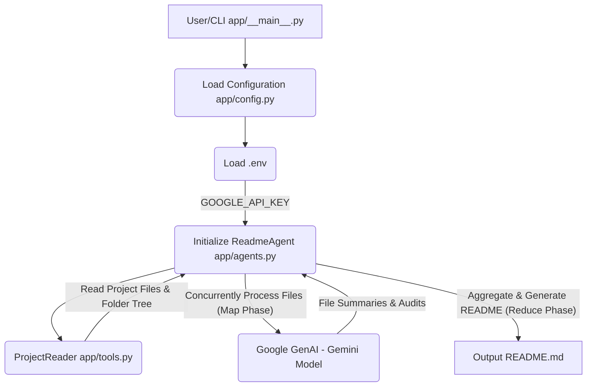

# RepoXray: AI-Powered Project Documentation Generator

RepoXray is an advanced AI agent designed to automatically generate comprehensive `README.md` files for software projects. Leveraging Google's Gemini models, it employs a sophisticated Map-Reduce strategy to analyze codebase structure, summarize individual files, infer technologies, provide setup instructions, and audit code health and security. The goal is to produce high-quality, up-to-date documentation with minimal human intervention.

## 📊 Architecture Diagram



## Folder Structure

```
📁 RepoXray/
    📄 .env
    📄 README.md
    📄 requirements.txt
    📁 app/
        📄 agents.py
        📄 config.py
        📄 tools.py
        📄 __main__.py
```

## Architecture/Tech Stack

RepoXray is built primarily with **Python 3**. Its core functionality relies on:

*   **Google GenAI (Gemini Models)**: For natural language understanding, summarization, and content generation.
*   **Map-Reduce Pattern**: To efficiently process multiple files concurrently (Map) and then synthesize information into a coherent README (Reduce).
*   **`python-dotenv`**: For secure management and loading of environment variables, specifically API keys.
*   **`tenacity`**: For robust retry logic when interacting with external APIs, enhancing reliability.
*   **Concurrent Processing**: Utilizing Python's concurrency primitives (likely `concurrent.futures`) to speed up file analysis.

## Setup & Usage

To get RepoXray up and running, follow these steps:

### Prerequisites

*   **Python 3.8+**
*   A **Google API Key** for accessing Gemini models.

### Installation

1.  **Clone the repository:**
    ```bash
    git clone https://github.com/your-repo/RepoXray.git
    cd RepoXray
    ```
2.  **Create a `.env` file:**
    In the root directory of the project (e.g., `RepoXray/.env`), create a file named `.env` and add your Google API Key:
    ```env
    GOOGLE_API_KEY="YOUR_GOOGLE_API_KEY_HERE"
    ```
    **Important**: Ensure this file is excluded from version control (`.gitignore`) to prevent credential exposure.
3.  **Install dependencies:**
    ```bash
    pip install -r requirements.txt
    ```

### Usage

Run the `__main__.py` script from the `app` directory. You can specify a target directory, or it will default to the current working directory.

```bash
# Generate README for the current directory
python app

# Generate README for a specific project directory
python app /path/to/your/project
```

The generated `README.md` will be placed in the current working directory from which you execute the script (or the specified target directory if applicable).

## File Overview

*   **`.env`**: Stores environment-specific variables, primarily the `GOOGLE_API_KEY`.
*   **`requirements.txt`**: Lists all Python package dependencies required for the project.
*   **`app/config.py`**: Centralized configuration management. Loads environment variables and provides structured access to settings like `GOOGLE_API_KEY` and AI model names. Includes validation for critical variables.
*   **`app/tools.py`**: Defines the `ProjectReader` class. This utility navigates the project directory, generates folder structures, and reads file contents, intelligently filtering out irrelevant files based on common patterns and `.gitignore` rules.
*   **`app/agents.py`**: Contains the core `ReadmeAgent` class. This orchestrates the entire README generation process using a Map-Reduce strategy, leveraging Google GenAI to summarize files, perform audits, and synthesize the final `README.md`.
*   **`app/__main__.py`**: The main entry point of the application. It parses command-line arguments, initializes the `ReadmeAgent`, and triggers the README generation process, including basic error handling.

## 🕵️‍♂️ Code Health & Security Audit

This audit aggregates findings across the RepoXray repository, highlighting key areas for improvement in security, code quality, and documentation.

### Security Findings

The most critical security finding relates to the **`GOOGLE_API_KEY`** stored in the `.env` file. While `app/config.py` correctly loads this as an environment variable, the `.env` file itself, containing a live API key, represents a significant **credential exposure risk** if committed to a public repository or improperly handled in deployment. It is paramount to ensure `.env` is always excluded from version control via `.gitignore` and handled securely in CI/CD pipelines. Additionally, `app/tools.py` (specifically the `ProjectReader`'s `root_dir` input) requires external validation by the calling application (`app/__main__.py`) to prevent potential **path traversal vulnerabilities** if arbitrary or untrusted paths were ever accepted.

### Code Quality & Maintainability

1.  **Missing Docstrings**: There is a pervasive lack of docstrings throughout the project. Specifically, all methods in `app/tools.py`, the `ReadmeAgent` class and its `__init__` method in `app/agents.py`, and the `main` function in `app/__main__.py` are missing comprehensive docstrings. This significantly hinders code readability, maintainability, and onboarding for new developers.
2.  **Inconsistent Logging**: The project extensively uses `print()` statements for progress updates, warnings, and errors across `app/tools.py`, `app/agents.py`, and `app/__main__.py`. This is a code smell. A more robust and configurable approach would be to adopt Python's standard `logging` module, allowing for flexible log levels, handlers, and structured output suitable for production environments. Error messages in `app/__main__.py` are printed to `sys.stdout` instead of the more appropriate `sys.stderr`.
3.  **Hardcoding and Magic Numbers**:
    *   `app/tools.py` includes hardcoded `ignore_dirs` and `ignore_extensions`, limiting flexibility for customization. These should ideally be configurable.
    *   `app/agents.py` contains several "magic numbers" (e.g., `15000` for content truncation, `3` for `time.sleep`, `max_workers`, `tenacity` parameters). These values should be externalized as named constants or configuration variables for improved readability and easier modification.
4.  **Embedded Prompts**: While functional, the long prompt templates within `app/agents.py` are embedded directly in methods. For more complex or frequently changing prompts, externalizing them into separate files or a dedicated prompt management module would enhance organization and maintainability.
5.  **Design Inconsistency (README Template)**: The existing `README.md` file in the repository (serving as a template) is entirely written in HTML despite its `.md` extension. This deviates from standard Markdown conventions and can lead to inconsistent rendering on platforms like GitHub or GitLab, diminishing readability and platform integration.

### Functional Limitations & Performance

1.  **Simplified `.gitignore` Parsing**: The `_is_ignored` method in `app/tools.py` uses `fnmatch` for `.gitignore` pattern matching, which is a simplification that does not fully replicate Git's complex `.gitignore` specification (e.g., it lacks support for negation, directory-only patterns, or relative paths). This could lead to incorrect file inclusions or exclusions in edge cases.
2.  **Performance Bottlenecks**: `app/agents.py` exhibits potential performance limitations, particularly for larger projects. A rudimentary `time.sleep(3)` rate limiter per file (likely for the Gemini Free Tier) combined with a low `max_workers` (capped at 3) significantly slows down processing. A more sophisticated rate-limiting strategy or a higher-tier API plan would be essential for scalability.
3.  **Content Truncation**: The hardcoded truncation of file content (`content[:15000]`) in `app/agents.py` due to LLM context window limits means that very large files might not be fully analyzed. This could result in incomplete summaries or audit reports for those specific files.

### Summary

RepoXray demonstrates a solid functional core for AI-driven README generation. However, addressing the identified security concerns, especially surrounding API key management, is paramount. Significant improvements in code quality, primarily through the addition of comprehensive docstrings, adoption of proper logging, and the refactoring of hardcoded values and embedded prompts, would greatly enhance the project's maintainability and long-term viability. Future work should also focus on refining the `.gitignore` parsing and optimizing the performance for larger codebases.