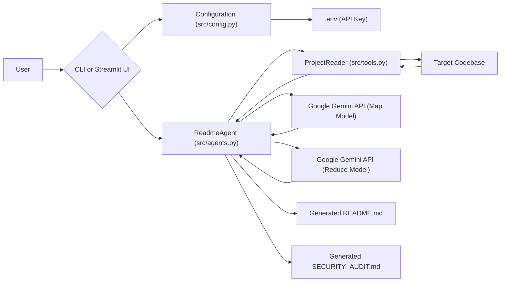

# RepoXray: AI-Powered Codebase Documentation and Security Audit

RepoXray is an intelligent tool designed to automatically generate comprehensive `README.md` documentation and `SECURITY_AUDIT.md` reports for any given codebase. Leveraging Google's Gemini AI models, it scans project files, summarizes their functionality, identifies potential security concerns, and consolidates this information into well-structured Markdown reports.

## Overview

RepoXray streamlines the documentation and security review process for developers. By integrating with the Google Gemini API, it performs a deep analysis of source code, filtering out irrelevant files and focusing on the core logic. The tool employs a "Map-Reduce" strategy, where individual files are summarized and audited in parallel (Map phase), and then these insights are aggregated to produce a holistic project overview and security assessment (Reduce phase). It offers both a command-line interface (CLI) for quick scans and a Streamlit-based web UI for interactive use.

## Feature Set

*   **AI-Driven Documentation**: Automatically generates a detailed `README.md` file summarizing the project's purpose, structure, and key components.
*   **AI-Powered Security Audits**: Produces a `SECURITY_AUDIT.md` report highlighting potential vulnerabilities, bugs, and security considerations within the codebase.
*   **Intelligent File Filtering**: Skips irrelevant files and directories (e.g., `.git`, `node_modules`, `venv`, binary files) and respects `.gitignore` rules to optimize LLM context usage.
*   **Multi-threaded File Processing**: Efficiently reads and processes multiple files concurrently, speeding up the initial codebase ingestion.
*   **Robust API Interaction**: Implements retry mechanisms (`tenacity`) for Google Gemini API calls, ensuring resilience against transient network issues or rate limits.
*   **Configurable LLM Models**: Allows specification of different Gemini models for the Map and Reduce phases via environment variables.
*   **Flexible Interface**: Supports both a command-line interface (CLI) for scripting and a user-friendly Streamlit web application.
*   **Secure Credential Handling**: Manages the Google API key securely via environment variables.

## Architecture Diagram



## Project Structure

```
.
├── .env.example             # Example file for environment variables
├── docker.compose.yaml      # Docker Compose configuration for containerized deployment
├── README.md                # This documentation file
├── SECURITY_AUDIT.md        # Self-assessment security audit report (generated)
└── src/                     # Source code directory
    ├── __init__.py          # Python package initializer
    ├── __main__.py          # CLI entry point for the application
    ├── agents.py            # Core logic for AI agents (ReadmeAgent)
    ├── config.py            # Centralized configuration management
    ├── file_reader.py       # (Legacy/Alternative) File reading utility
    ├── tools.py             # Primary file reading, filtering, and folder tree generation
    └── ui.py                # Streamlit web application interface
```

## Technical Stack

*   **Language**: Python 3.x
*   **AI/LLM**: Google Gemini API
*   **LLM Client**: `google-generativeai`
*   **Robustness**: `tenacity` (for API call retries)
*   **Configuration**: `python-dotenv` (for environment variable management)
*   **Web UI**: `streamlit`
*   **Concurrency**: `concurrent.futures` (for multi-threaded file processing)

## Setup

Follow these steps to get RepoXray up and running on your local machine.

### Prerequisites

*   Python 3.8+
*   A Google Cloud Project with the Gemini API enabled.
*   A Google API Key for the Gemini API.

### Installation

1.  **Clone the repository:**
    ```bash
    git clone https://github.com/shreeg25pip/RepoXray.git
    cd RepoXray
    ```

2.  **Create a virtual environment (recommended):**
    ```bash
    python -m venv venv
    source venv/bin/activate  # On Windows: `venv\Scripts\activate`
    ```

3.  **Install dependencies:**
    ```bash
    pip install -r requirements.txt
    ```
    *(Note: A `requirements.txt` file is not provided in the context, but would typically contain: `google-generativeai`, `python-dotenv`, `tenacity`, `streamlit`)*

4.  **Configure your Google API Key:**
    *   Rename `.env.example` to `.env`.
    *   Open `.env` and replace `YOUR_GOOGLE_API_KEY` with your actual Google Gemini API key.
    ```ini
    GOOGLE_API_KEY="YOUR_GOOGLE_API_KEY"
    # Optional: Configure specific Gemini models
    # MAP_MODEL="gemini-2.5-flash"
    # REDUCE_MODEL="gemini-2.5-flash"
    ```

### Usage

#### Command-Line Interface (CLI)

To generate documentation and security audits for a codebase from your terminal:

```bash
python -m src [target_directory]
```

*   Replace `[target_directory]` with the path to the codebase you want to analyze.
*   If `[target_directory]` is omitted, the current directory (`.`) will be used.

**Example:**
```bash
python -m src .
```
This will generate `README.md` and `SECURITY_AUDIT.md` in the current working directory.

#### Streamlit Web Application

For an interactive web interface:

1.  **Run the Streamlit application:**
    ```bash
    streamlit run src/ui.py
    ```

2.  **Access the UI:**
    Open your web browser and navigate to the URL provided by Streamlit (usually `http://localhost:8501`).
    You can then input the target directory path directly in the web interface to initiate the scan.